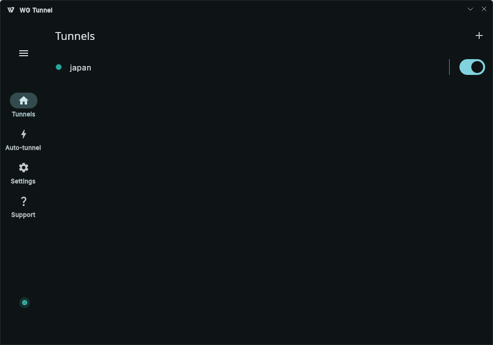

# WG Tunnel - Desktop

A WireGuard and AmneziaWG client for desktop.

<div style="text-align: left;">
  
</div>

# Supported Platforms
- macOS (Planned)
- Windows
- Linux

# Features
- Support for WireGuard and AmneziaWG tunnel configurations
- Independent lockdown mode (kill switch)
- Lockdown and previous tunnel restoration on boot
- Tunnel runs as a system service (daemon) independent of the application GUI
- Encrypted storage of tunnel configs with system keychain integration
- Tunnel import, export, editing, live statistics, and sorting

# Installation

## Windows

> **Note:** Only Windows 11 and 10 patch `10.0.19041.0` and greater are supported.

1. Download the `.msix` file from latest release.
2. Launch the installer by double-clicking on the download.
3. Proceed through the installation prompts (will require relaunching the installer as administrator).

## Linux

> **Note:** Only `systemd`-based Linux systems are currently supported. Also, the firewall must use `nftables` or `iptables` with the nft backend (`iptables-nft`).

### Debian Install

This is the easiest method and gives you **automatic updates** for the app and daemon through your normal system package manager.

1. Download the `.deb` file from the latest release.
2. From the directory where you downloaded the file:

**Install**
```bash
sudo apt install ./wgtunnel*.deb
```

### Arch Linux

For Arch, the app is available on the [AUR](https://aur.archlinux.org/packages/wgtunnel-bin).  
You can install it using an AUR helper such as `yay`:

**Install**
```bash
yay -S wgtunnel-bin
```

**Start Daemon**
```bash
sudo systemctl enable --now wgtunnel-daemon.service
```

### Linux Tarball Installation (Manual updates only)

For users on immutable distros, NixOS, or who prefer zero repository footprint.

1. Download the `tar.gz` file from the latest release.
2. From the directory where you downloaded the file:

**Install**
```bash 
# Download and extract the tarball, download install script, and execute
tar -xzf wgtunnel-*.tar.gz && \
cd wgtunnel-*/ && \
curl -LO https://raw.githubusercontent.com/wgtunnel/desktop/master/scripts/linux/install.sh && \
chmod +x install.sh && \
./install.sh
```

**Uninstall** (Optional)
```bash
curl -LO https://raw.githubusercontent.com/wgtunnel/desktop/master/scripts/linux/uninstall.sh && \
chmod +x uninstall.sh && \
./uninstall.sh
```

## Known issues

On Windows, switching the active network interface (like switching Ethernet → Wi-Fi or Wi-Fi → Ethernet) while a tunnel is active may cause the connection to drop.

**Workaround:** Restart the tunnel after changing network interfaces.


