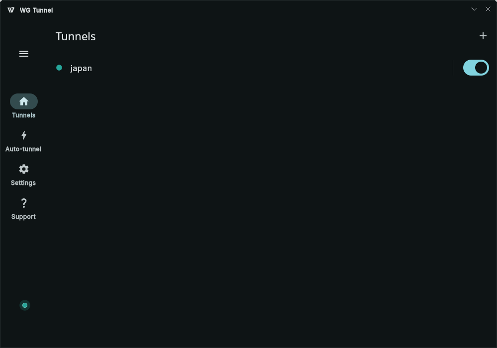

<h1 align="center">
WG Tunnel - Desktop
</h1>

<div align="center">

An FOSS desktop client for [WireGuard](https://www.wireguard.com/)
and [AmneziaWG](https://docs.amnezia.org/documentation/amnezia-wg/)
<br />
<br />
<a href="https://github.com/wgtunnel/desktop/issues/new?assignees=zaneschepke&labels=bug&title=%5BBUG%5D+-+Problem+with+app">Report a Bug</a>
·
<a href="https://github.com/wgtunnel/desktop/issues/new?assignees=zaneschepke&labels=enhancement&title=%5BFEATURE%5D+-+New+feature+request">Request a Feature</a>
·
<a href="https://github.com/wgtunnel/desktop/discussions">Ask a Question</a>

</div>

<br/>

<div align="center">

[](https://t.me/wgtunnel)
[](https://matrix.to/#/#wg-tunnel-space:matrix.org)
</div>

<details open="open">
<summary>Table of Contents</summary>

- [About](#about)
- [Supported Platforms](#supported-platforms)
- [Features](#features)
- [Deferred Endpoint Bootstrapping](#deferred-endpoint-bootstrapping)
- [Installation](#installation)
- [Development](#development)
- [Contributing](#contributing)

</details>

<div style="text-align: left;">

## About

WG Tunnel is an alternative desktop client for WireGuard and AmneziaWG that brings the
[Android app's](https://github.com/wgtunnel/android) feature set to the desktop.

</div>

<div style="text-align: left;">
  
</div>

## Supported Platforms

- Windows
- Linux
- macOS - **not yet supported**, but planned for a future release.

## Features

This app shares its tunnel/DNS/recovery engine with the
[Android app](https://github.com/wgtunnel/android#features), so most android feature apply here too:

- **Auto-Tunneling:** Automatically activate tunnels based on the machine's active network details.
- **Deferred Endpoint Bootstrapping:** Safely resolves endpoints and updates peers after the tunnel is up for better reliability and leak protection on startup.
- **Handshake Monitoring:** Real-time handshake monitoring for instant tunnel health feedback.
- **AmneziaWG Support:** Full support for AmneziaWG 2.0 through 3.1, providing robust censorship protection.
- **Split & Encrypted DNS:** Resolve DNS through the tunnel using plain DNS, DoT, or DoH, and optionally split by domain suffix (tunnel or system).
- **Local Proxy Mode:** Expose WireGuard tunnels over a local SOCKS5 or HTTP proxy to browsers or other apps.
- **Kill switch:** A system-wide, tunnel-independent, kill switch that blocks all traffic and is layerable on top of either mode.
- **Dynamic DNS Handling:** Automatically detect and update endpoints on server IP changes without requiring a restart.
- **IPv6 Endpoints:** Automatically upgrade to IPv6 endpoints or fall back to IPv4 based on network conditions without requiring a restart.

Desktop-specific:

- **Native Application:** Ships as a GraalVM native image (not a JVM/Electron style app) for fast startup and a low memory footprint.
- **System Service Daemon:** The tunnel runs as an independent system service, so it keeps running (and enables restore on boot features) even when the GUI is not.
- **Kill switch & Tunnel Restoration on Boot:** Reapplies lockdown and reconnects the last active tunnel automatically after a reboot.
- **Encrypted At Rest:** Tunnel configs and other sensitive data are stored encrypted (AES-256-GCM) in the local database while the encryption key lives in the OS keychain/credential store.
- **Tunnel Management:** Import, export, editing, live statistics (including uptime and, in Local Proxy mode, the active proxy address/auth status), and sorting.
- **System Tray Integration:** Minimize to tray with a live status badge.
- **App Updater:** In-app updater and update notifications (only for `.deb`/`.rpm` and Windows installs).

## Deferred Endpoint Bootstrapping

Most WireGuard clients resolve peer endpoints before bring the tunnel up. This has several drawbacks:
1. If resolution fails or is slow (a flaky network, a DNS hiccup, a blocked resolver) the tunnel
simply doesn't come up, and there's no protection until it does.
2. During that resolution window, you're leaking until resolution completes successfully.

WG Tunnel splits these apart and removes peer resolution from the critical path. The TUN interface, 
routes, and firewall rules come up first, prioritizing user protection. Peer endpoint resolution then 
happens separately, in the background, retrying indefinitely until it succeeds.

This has significant benefits:

- **Immediate protection** The user is protected the moment the tunnel is toggled on, regardless of
  whether or when endpoint resolution succeeds. This dramatically reduces a leak window that other clients
  suffer from.
- **Reliability** The tunnel never fails to come up because of a flaky network or 
  resolution failures. The tunnel is already up and blocking traffic while DNS keeps retrying in the
  background until it connects.

## Installation

### Windows

> [!WARNING]
> Before installing v2.x.x and greater on Windows, it is required to uninstall the v1.x.x if you have it installed. The architecture
> of the app has changed significantly in the latest version and requires the old version to be removed.

> [!NOTE]
> Requires Windows 10 version 1803 (build 17134) or later for UDS support. The installer checks this and will refuse
> to install on an older build.

1. Download the Windows installer (`.exe`) from the latest release.
2. Run the installer. Accept the Admin rights prompt (UAC) so the daemon can be installed as a system service.
3. Launch the app.

### Linux

> [!NOTE]
> Only `systemd`-based Linux systems are currently supported. Also, the firewall must use `nftables` or `iptables` with the nft backend (`iptables-nft`).

#### Debian / Ubuntu

1. Download the `.deb` file from the latest release.
2. From the directory where you downloaded the file:

```bash
sudo apt install ./wgtunnel*.deb
```

#### Fedora / RHEL

From the GitHub release:

```bash
sudo rpm -Uvh wgtunnel*.rpm
```

[//]: # (Or from COPR &#40;see `packaging/RELEASE_LINUX.md`&#41;:)

[//]: # ()
[//]: # (```bash)

[//]: # (sudo dnf copr enable <fedora-user>/wgtunnel)

[//]: # (sudo dnf install wgtunnel)

[//]: # (```)

#### Arch Linux

From the GitHub release:

```bash
sudo pacman -U wgtunnel*.pacman
```

> [!Note]
> Per Arch packaging guidelines, the installation does not enable or start the daemon for you. The app will tell
you and provide the command to start the daemon if it is not reachable or is running an incompatible version.

Or from the AUR:

```bash
yay -S wgtunnel-bin
```

#### Other distros (`.tar.gz`)

Use this only if none of the formats above fit your distro. The tarball bundles its own
`install.sh` / `uninstall.sh` (the same install location and systemd configuration the `.deb`/`.rpm`/
`.pacman` packages use under the hood. See `packaging/linux/tar-install.sh` in the source repo if
you want to see the source script:

```bash
tar -xzf wgtunnel*-linux-x64.tar.gz
cd wgtunnel*-linux-x64/
sudo ./install.sh
```

To update, just run `sudo ./install.sh` again from a newer tarball. It copies over the
existing install and restarts the daemon. To remove it entirely: `sudo /opt/wgtunnel/uninstall.sh`.

In-app updates aren't available for this install method.

#### Removing saved data

Uninstalling normally leaves your saved tunnels, settings, and logs in place, so a reinstall picks 
up where you left off. To wipe everything:

- **Debian/Ubuntu**: `sudo apt purge wgtunnel`
- **Fedora/RHEL, Arch (GitHub release or AUR)**: there is no built-in purge so to remove after
  uninstalling:
  ```bash
  sudo rm -rf /var/lib/wgtunnel /etc/wgtunnel /var/log/wgtunnel
  rm -rf ~/.local/share/wgtunnel ~/.wgtunnel
  ```
- **Tarball**: `sudo /opt/wgtunnel/uninstall.sh --purge`

None of these clear the saved secret in your OS keyring (service `wg_tunnel`). You will need to 
remove that yourself with your keyring manager.

> [!Note] 
> Snap, Flatpak, and AppImages are not shipped and there is no plan currently to add them. The 
> simply are not a good fit for the app due to their sandboxing limitations.

## Development

### Requirements

- Toolchains pinned in `.mise.toml` (JDK, Node, Go, .NET) - installed for you by `mise install` below.
- A C toolchain for the host platform.
- **MinGW-w64** (`x86_64-w64-mingw32-gcc`)
-  [WG Tunnel's Nucleus fork](https://github.com/wgtunnel/Nucleus) cloned in the same parent directory
as this project

### Run locally

```bash
# once per machine
curl https://mise.run | sh
mise trust
mise install
```

Start the daemon - it needs elevated privileges to manage routes/firewall, so use the dev
script.

```bash
./scripts/dev-run-daemon-linux.sh
```

Then, in another terminal, run the GUI:

```bash
./gradlew :composeApp:run
```

## Contributing

Any contributions in the form of feedback, issues, code, or translations are welcome and much
appreciated!

If your PR requires [core](https://github.com/wgtunnel/core) changes, please link the associated PR.
